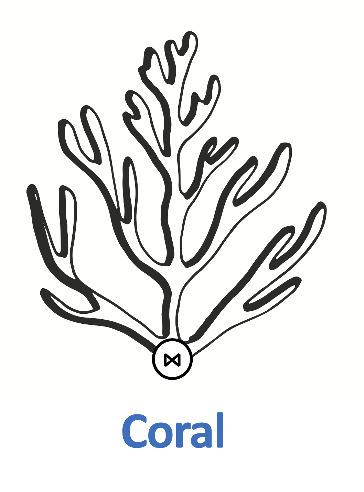

# Coral

<p align="center">
 
</p>

**Coral** is a library for analyzing, processing, and rewriting views defined in the Hive Metastore, and sharing them
across multiple execution engines. It performs SQL translations to enable views expressed in HiveQL (and potentially
other languages) to be accessible in engines such as [Trino (formerly PrestoSQL)](https://trino.io/),
[Apache Spark](https://spark.apache.org/), and [Apache Pig](https://pig.apache.org/).
Coral not only translates view definitions between different SQL/non-SQL dialects, but also rewrites expressions to
produce semantically equivalent ones, taking into account the semantics of the target language or engine.
For example, it automatically composes new built-in expressions that are equivalent to each built-in expression in the
source view definition. Additionally, it integrates with [Transport UDFs](https://github.com/linkedin/transport)
to enable translating and executing user-defined functions (UDFs) across Hive, Trino, Spark, and Pig. Coral is under
active development. Currently, we are looking into expanding the set of input view language APIs beyond HiveQL,
and implementing query rewrite algorithms for data governance and query optimization.

##  Slack

- Join the discussion with the community on Slack [here](https://join.slack.com/t/coral-sql/shared_invite/zt-s8te92up-qU5PSG~spK33ovPPL5v96A)!

## Modules

**Coral** consists of following modules:

- Coral-Hive: Converts definitions of Hive views with UDFs to equivalent view logical plan.
- Coral-Trino: Converts view logical plan to Trino (formerly PrestoSQL) SQL.
- Coral-Spark: Converts view logical plan to Spark SQL.
- Coral-Pig: Converts view logical plan to Pig-latin.
- Coral-Schema: Derives Avro schema of view using view logical plan and input Avro schemas of base tables.
- Coral-Spark-Plan: Converts Spark plan strings to equivalent logical plan (in progress).

## How to Build

Clone the repository:

```bash
git clone https://github.com/linkedin/coral.git
```

Build:

```bash
./gradlew clean build
```

## Contributing

The project is under active development and we welcome contributions of different forms.
Please see the [Contribution Agreement](CONTRIBUTING.md).

## Resources

- [Coral: A SQL translation, analysis, and rewrite engine for modern data lakehouses](https://engineering.linkedin.com/blog/2020/coral), LinkedIn Engineering Blog, 12/10/2020.
- [Coral & Transport UDFs: Building Blocks of a Postmodern Data Warehouse](https://www.slideshare.net/walaa_eldin_moustafa/coral-transport-udfs-building-blocks-of-a-postmodern-data-warehouse-229545076), Tech-talk, Facebook HQ, 2/28/2020.
- [Transport: Towards Logical Independence Using Translatable Portable UDFs](https://engineering.linkedin.com/blog/2018/11/using-translatable-portable-UDFs), LinkedIn Engineering Blog, 11/14/2018.
- [Dali Views: Functions as a Service for Big Data](https://engineering.linkedin.com/blog/2017/11/dali-views--functions-as-a-service-for-big-data), LinkedIn Engineering Blog, 11/9/2017.
