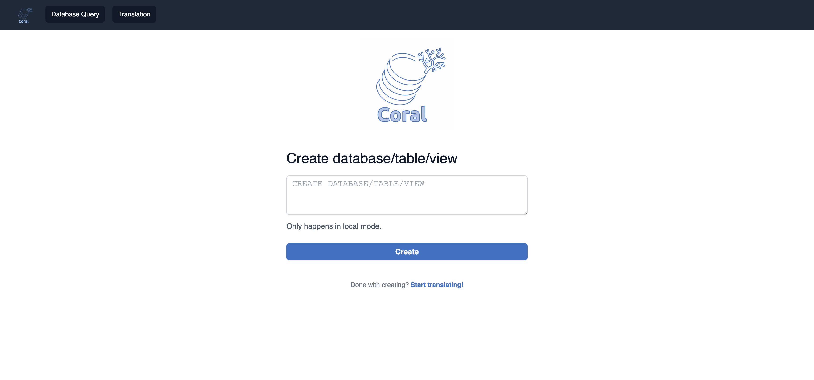

# Coral

<p align="center">
 
</p>

**Coral** is a library for analyzing, processing, and rewriting views defined in the Hive Metastore, and sharing them
across multiple execution engines. It performs SQL translations to enable views expressed in HiveQL (and potentially
other languages) to be accessible in engines such as [Trino (formerly PrestoSQL)](https://trino.io/),
[Apache Spark](https://spark.apache.org/), and [Apache Pig](https://pig.apache.org/).
Coral not only translates view definitions between different SQL/non-SQL dialects, but also rewrites expressions to
produce semantically equivalent ones, taking into account the semantics of the target language or engine.
For example, it automatically composes new built-in expressions that are equivalent to each built-in expression in the
source view definition. Additionally, it integrates with [Transport UDFs](https://github.com/linkedin/transport)
to enable translating and executing user-defined functions (UDFs) across Hive, Trino, Spark, and Pig. Coral is under
active development. Currently, we are looking into expanding the set of input view language APIs beyond HiveQL,
and implementing query rewrite algorithms for data governance and query optimization.

##  Slack

- Join the discussion with the community on Slack [here](https://join.slack.com/t/coral-sql/shared_invite/zt-s8te92up-qU5PSG~spK33ovPPL5v96A)!

## Modules

**Coral** consists of following modules:

- Coral-Hive: Converts definitions of Hive views with UDFs to equivalent view logical plan.
- Coral-Trino: Converts view logical plan to Trino (formerly PrestoSQL) SQL, and vice versa.
- Coral-Spark: Converts view logical plan to Spark SQL.
- Coral-Pig: Converts view logical plan to Pig-latin.
- Coral-Schema: Derives Avro schema of view using view logical plan and input Avro schemas of base tables.
- Coral-Spark-Plan: Converts Spark plan strings to equivalent logical plan (in progress).
- Coral-Service: Service that exposes REST APIs that allow users to interact with Coral (see [Coral-as-a-Service](#Coral-as-a-Service) for more details).

## How to Build

Clone the repository:

```bash
git clone https://github.com/linkedin/coral.git
```

Build:

```bash
./gradlew clean build
```

## Contributing

The project is under active development and we welcome contributions of different forms.
Please see the [Contribution Agreement](CONTRIBUTING.md).

## Resources

- [Coral: A SQL translation, analysis, and rewrite engine for modern data lakehouses](https://engineering.linkedin.com/blog/2020/coral), LinkedIn Engineering Blog, 12/10/2020.
- [Coral & Transport UDFs: Building Blocks of a Postmodern Data Warehouse](https://www.slideshare.net/walaa_eldin_moustafa/coral-transport-udfs-building-blocks-of-a-postmodern-data-warehouse-229545076), Tech-talk, Facebook HQ, 2/28/2020.
- [Transport: Towards Logical Independence Using Translatable Portable UDFs](https://engineering.linkedin.com/blog/2018/11/using-translatable-portable-UDFs), LinkedIn Engineering Blog, 11/14/2018.
- [Dali Views: Functions as a Service for Big Data](https://engineering.linkedin.com/blog/2017/11/dali-views--functions-as-a-service-for-big-data), LinkedIn Engineering Blog, 11/9/2017.


## Coral-as-a-Service

**Coral-as-a-Service** or simply, **Coral Service** is a service that exposes REST APIs that allow users to interact with Coral without necessarily coming from a compute engine. Currently, the service supports an API for query translation between different dialects and another for interacting with a local Hive Metastore to create example databases, tables, and views so they can be referenced in the translation API. The service can be used in two modes: remote Hive Metastore mode, and local Hive Metastore mode. The remote mode uses an existing (already deployed) Hive Metastore to resolve tables and views, while the local one creates an empty embedded Hive Metastore so users can add their own table and view definitions.

### API Reference

#### /api/translations/translate
A **POST** API which takes JSON request body containing following parameters and returns the translated query:
- `fromLanguage`: Input dialect (e.g., spark, trino, hive -- see below for supported inputs)
- `toLanguage`: Output dialect (e.g., spark, trino, hive -- see below for supported outputs)
- `query`: SQL query to translate between two dialects

#### /api/catalog-ops/execute
A **POST** API which takes a SQL statement to create a database/table/view in the local metastore
(note: this endpoint is only available with Coral Service in local metastore mode).

### Instructions to use with examples
1. Clone [Coral repo](https://github.com/linkedin/coral)
```bash  
git clone https://github.com/linkedin/coral.git  
```  
2. From the root directory of Coral, access the coral-service module
```bash  
cd coral-service  
```  
3. Build
```bash  
../gradlew clean build  
```  
#### To run Coral Service using the **local metastore**:
4. Run
```bash  
../gradlew bootRun --args='--spring.profiles.active=localMetastore'  
```

#### To run Coral Service using the **remote metastore**:
4. Add your kerberos client keytab file to `coral-service/src/main/resources`
5. Appropriately replace all instances of `SET_ME` in `coral-service/src/main/resources/hive.properties`
6. Run
```  
../gradlew bootRun  
```  

Then you can interact with the service using your [browser](#coral-service-ui) or the [CLI](#coral-service-cli).

### Coral Service UI
After running `../gradlew bootRun --args='--spring.profiles.active=localMetastore'` (for local metastore mode) 
or `../gradlew bootRun` (for remote metastore mode) from coral-service module, 
the UI can be accessed from the browser. Use the URL http://localhost:8080 to run the UI on a local browser.
<p align="center">
 
</p>

The UI provides 2 features:
#### Create a database/table/view in local metastore mode
This feature is only available with Coral Service in local metastore mode, it calls `/api/catalog-ops/execute` API above.

You can enter a SQL statement to create a database/table/view in the local metastore:
<p align="center">
 
</p>

#### Translate SQL from source language to target language
This feature is available with Coral Service in both local and remote metastore modes, it calls `/api/translations/translate` API above.

You can enter a SQL query and specify the source and target language to use Coral translation service:
<p align="center">
 
</p>

### Coral Service CLI
Apart from the UI above, you can also interact with the service using the CLI.

Example workflow for local metastore mode:

1. Create a database called `db1` in local metastore using the `/api/catalog-ops/execute` endpoint

```bash
curl --header "Content-Type: application/json" \
  --request POST \
  --data "CREATE DATABASE IF NOT EXISTS db1" \
  http://localhost:8080/api/catalog-ops/execute

Creation successful
```
2. Create a table called `airport` within `db1` in local metastore using the `/api/catalog-ops/execute` endpoint

```bash
curl --header "Content-Type: application/json" \
  --request POST \
  --data "CREATE TABLE IF NOT EXISTS db1.airport(name string, country string, area_code int, code string, datepartition string)" \
  http://localhost:8080/api/catalog-ops/execute

Creation successful
```

3. Translate a query on `db1.airport` in local metastore using the `/api/translations/translate` endpoint

```bash
curl --header "Content-Type: application/json" \
  --request POST \
  --data '{
    "fromLanguage":"hive", 
    "toLanguage":"trino", 
    "query":"SELECT * FROM db1.airport"
  }' \
  http://localhost:8080/api/translations/translate
```
The translation result is:
```
Original query in Hive QL:
SELECT * FROM db1.airport
Translated to Trino SQL:
SELECT "name", "country", "area_code", "code", "datepartition"
FROM "db1"."airport"
```


### Currently Supported Translation Flows
1. Hive to Trino
2. Hive to Spark
3. Trino to Spark  
   Note: During Trino to Spark translations, views referenced in queries are considered to be defined in HiveQL and hence cannot be used when translating a view from Trino. Currently, only referencing base tables is supported in Trino queries. This translation path is currently a POC and may need further improvements.
