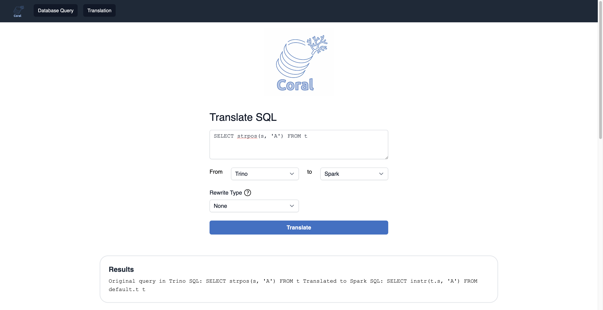
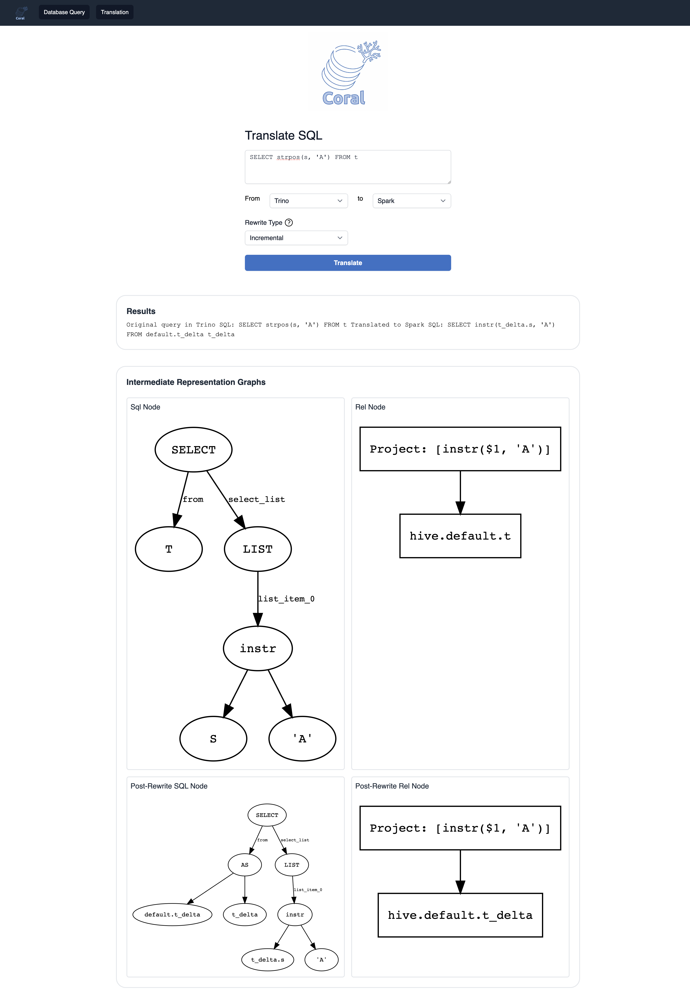

# Coral

<p align="center">
 
</p>

**Coral** is a SQL translation, analysis, and rewrite engine. It establishes a standard intermediate representation, 
Coral IR, which captures the semantics of relational algebraic expressions independently of any SQL dialect. Coral IR
is defined in two forms: one is the at the abstract syntax tree (AST) layer, and the other is at the logical plan layer.
Both forms are isomorphic and convertible to each other.

Coral exposes APIs for implementing conversions between SQL dialects and Coral IR in both directions.
Currently, Coral supports converting HiveQL and Spark SQL to Coral IR, and converting Coral IR to HiveQL, Spark SQL,
and Trino SQL. With multiple SQL dialects supported, Coral can be used to translate SQL statements and views defined in
one dialect to equivalent ones in another dialect. It can also be used to interoperate between engines and SQL-powered 
data sources. For dialect conversion examples, see the modules [coral-hive](coral-hive), [coral-spark](coral-spark), 
and [coral-trino](coral-trino).

Coral also exposes APIs for Coral IR rewrite and manipulation. This includes rewriting Coral IR expressions to produce
semantically equivalent, but more performant expressions. For example, Coral automates
incremental view maintenance by rewriting a view definition to an incremental one. See the module [coral-incremental](coral-incremental)
for more details. Other Coral rewrite applications include data governance and policy enforcement.

Coral can be used as a library in other projects, or as a service. See instructions below for more details.

##  Slack

- Join the discussion with the community on Slack [here](https://join.slack.com/t/coral-sql/shared_invite/zt-s8te92up-qU5PSG~spK33ovPPL5v96A)!

## Modules

**Coral** consists of following modules:

- Coral-Hive: Converts HiveQL to Coral IR (can be typically used with Spark SQL as well).
- Coral-Trino: Converts Coral IR to Trino SQL. Converting Trino SQL to Coral IR is WIP.
- Coral-Spark: Converts Coral IR to Spark SQL (can be typically used with HiveQL as well).
- Coral-Dbt: Integrates Coral with DBT. It enables applying Coral transformations on DBT models.
- Coral-Incremental: Derives an incremental query from input SQL for incremental view maintenance.
- Coral-Schema: Derives Avro schema of view using view logical plan and input Avro schemas of base tables.
- Coral-Spark-Plan [WIP]: Converts Spark plan strings to equivalent logical plan.
- Coral-Visualization: Visualizes Coral SqlNode and RelNode trees and renders them to an output file.
- Coral-Service: Service that exposes REST APIs that allow users to interact with Coral (see [Coral-as-a-Service](#Coral-as-a-Service) for more details).

## Version Upgrades

This project adheres to semantic versioning, where the format x.y.z represents major, minor, and patch version upgrades. Consideration should be given to potential changes required when integrating different versions of this project.

**Major version Upgrade**

A major version upgrade represents a version change that introduces backward incompatibility by removal or renaming of classes.

**Minor version Upgrade**

A minor version upgrade represents a version change that introduces backward incompatibility by removal or renaming of methods.

Please carefully review the release notes and documentation accompanying each version upgrade to understand the specific changes and the recommended steps for migration.


## How to Build

Clone the repository:

```bash
git clone https://github.com/linkedin/coral.git
```

Build:

**Please note that this project requires Python 3 and Java 8 to run.** Set `JAVA_HOME` to the home of an appropriate version and then use:

```bash
./gradlew clean build
```
or, set the `org.gradle.java.home` gradle property to the Java home of an appropriate version as below:
```bash
./gradlew -Dorg.gradle.java.home=/path/to/java/home clean build
```

## Contributing

The project is under active development and we welcome contributions of different forms.
Please see the [Contribution Agreement](CONTRIBUTING.md).

## Resources

- [Coral: A SQL translation, analysis, and rewrite engine for modern data lakehouses](https://engineering.linkedin.com/blog/2020/coral), LinkedIn Engineering Blog, 12/10/2020.
- [Incremental View Maintenance with Coral, DBT, and Iceberg](https://www.slideshare.net/walaa_eldin_moustafa/incremental-view-maintenance-with-coral-dbt-and-iceberg), Tech Talk, Iceberg Meetup, 5/11/2023.
- [Coral & Transport UDFs: Building Blocks of a Postmodern Data Warehouse](https://www.slideshare.net/walaa_eldin_moustafa/coral-transport-udfs-building-blocks-of-a-postmodern-data-warehouse-229545076), Tech-talk, Facebook HQ, 2/28/2020.
- [Transport: Towards Logical Independence Using Translatable Portable UDFs](https://engineering.linkedin.com/blog/2018/11/using-translatable-portable-UDFs), LinkedIn Engineering Blog, 11/14/2018.
- [Dali Views: Functions as a Service for Big Data](https://engineering.linkedin.com/blog/2017/11/dali-views--functions-as-a-service-for-big-data), LinkedIn Engineering Blog, 11/9/2017.


## Coral-as-a-Service

**Coral-as-a-Service** or simply, **Coral Service** is a service that exposes REST APIs that allow users to interact with Coral without necessarily coming from a compute engine. Currently, the service supports an API for query translation between different dialects and another for interacting with a local Hive Metastore to create example databases, tables, and views so they can be referenced in the translation API. The service can be used in two modes: remote Hive Metastore mode, and local Hive Metastore mode. The remote mode uses an existing (already deployed) Hive Metastore to resolve tables and views, while the local one creates an empty embedded Hive Metastore so users can add their own table and view definitions.

### API Reference

#### /api/translations/translate
A **POST** API which takes JSON request body containing following parameters and returns the translated query:
- `sourceLanguage`: Input dialect (e.g., spark, trino, hive -- see below for supported inputs)
- `targetLanguage`: Output dialect (e.g., spark, trino, hive -- see below for supported outputs)
- `query`: SQL query to translate between two dialects
- [Optional] `rewriteType`: Type of Coral IR rewrite (e.g, incremental)

#### /api/catalog-ops/execute
A **POST** API which takes a SQL statement to create a database/table/view in the local metastore
(note: this endpoint is only available with Coral Service in local metastore mode).

### Instructions to use with examples
1. Clone [Coral repo](https://github.com/linkedin/coral)
```bash  
git clone https://github.com/linkedin/coral.git  
```
2. From the root directory of Coral, access the coral-service module
```bash  
cd coral-service  
```
3. Build
```bash  
../gradlew clean build  
```
#### To run Coral Service using the **local metastore**:
4. Run
```bash  
../gradlew bootRun --args='--spring.profiles.active=localMetastore'  
```

#### To run Coral Service using the **remote metastore**:
4. Add your kerberos client keytab file to `coral-service/src/main/resources`
5. Appropriately replace all instances of `SET_ME` in `coral-service/src/main/resources/hive.properties`
6. Run
```  
../gradlew bootRun  
```
You can also specify a custom location of `hive.properties` file through `--hivePropsLocation` as follows
```
 ./gradlew bootRun --args='--hivePropsLocation=/tmp/hive.properties'
```
Then you can interact with the service using your [browser](#coral-service-ui) or the [CLI](#coral-service-cli).

### Coral Service UI
After running `../gradlew bootRun --args='--spring.profiles.active=localMetastore'` (for local metastore mode) 
or `../gradlew bootRun` (for remote metastore mode) from coral-service module, configure and start the UI. 

Please note: The backend service runs on port 8080 (by default) and the web UI runs on port 3000 (by default). 

#### To configure environment variables:
1. Create a `.env.local` file in the frontend project's root directory
2. Copy over the template from `.env.local.example` into the new `.env.local` file
3. Fill in the environment variable values in `.env.local`

#### Install the required packages in the frontend directory:

```bash
npm install
```

#### Now you can start the Coral Service UI by running:
```bash  
npm run dev
```
Once compiled, the UI can be accessed from the browser at http://localhost:3000.
<p align="center">
 
</p>
The UI provides 3 features:

#### Create a database/table/view in local metastore mode
This feature is only available with Coral Service in local metastore mode, it calls `/api/catalog-ops/execute` API above.

You can enter a SQL statement to create a database/table/view in the local metastore.
<p align="center">
 
</p>

#### Translate SQL from source language to target language (with rewrites)
This feature is available with Coral Service in both local and remote metastore modes, it calls `/api/translations/translate` API above.

You can enter a SQL query and specify the source and target language to use Coral translation service. You can also 
specify the rewrite type to apply on the input query.
<p align="center">
 
</p>

#### Generate graphviz visualizations of Coral intermediate representations
During translation, graphs of the Coral intermediate representations
will also be generated and shown on screen. This will also include any post-rewrite nodes.
<p align="center">
 
</p>

#### Developing on the frontend code

#### To lint/format your code:
```bash  
npm run lint:fix
npm run format
```
### Coral Service CLI
Apart from the UI above, you can also interact with the service using the CLI.

Example workflow for local metastore mode:

1. Create a database called `db1` in local metastore using the `/api/catalog-ops/execute` endpoint

```bash
curl --header "Content-Type: application/json" \
  --request POST \
  --data "CREATE DATABASE IF NOT EXISTS db1" \
  http://localhost:8080/api/catalog-ops/execute

Creation successful
```
2. Create a table called `airport` within `db1` in local metastore using the `/api/catalog-ops/execute` endpoint

```bash
curl --header "Content-Type: application/json" \
  --request POST \
  --data "CREATE TABLE IF NOT EXISTS db1.airport(name string, country string, area_code int, code string, datepartition string)" \
  http://localhost:8080/api/catalog-ops/execute

Creation successful
```

3. Translate a query on `db1.airport` in local metastore using the `/api/translations/translate` endpoint

```bash
curl --header "Content-Type: application/json" \
  --request POST \
  --data '{
    "sourceLanguage":"hive", 
    "targetLanguage":"trino", 
    "query":"SELECT * FROM db1.airport"
  }' \
  http://localhost:8080/api/translations/translate
```
The translation result is:
```
Original query in HiveQL:
SELECT * FROM db1.airport
Translated to Trino SQL:
SELECT "name", "country", "area_code", "code", "datepartition"
FROM "db1"."airport"
```


### Currently Supported Translation Flows
1. Hive to Trino
2. Hive to Spark
3. Trino to Spark  
   Note: During Trino to Spark translations, views referenced in queries are considered to be defined in HiveQL and hence cannot be used when translating a view from Trino. Currently, only referencing base tables is supported in Trino queries. This translation path is currently a POC and may need further improvements.
4. Spark to Trino
